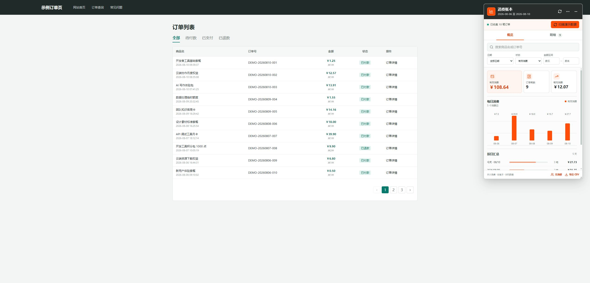

# 链动小铺消费助手（非官方）

一个面向 `pay.ldxp.cn/order` 订单列表页的非官方浏览器扩展。项目永久免费，在用户完成站点原有订单查询后，生成每日消费统计、可筛选订单明细和 CSV 文件。

> 本项目与链动小铺官方无隶属、授权或合作关系。“链动小铺”名称及相关标识归其权利人所有。



## 交流群

QQ 群：**613550608**

可在群内反馈问题、交流使用经验或讨论二次开发。请勿发送手机号、查询 ticket、真实订单号、卡密或其他敏感信息。


## 功能

- 按日汇总有效消费、订单笔数和笔均金额
- 按商品名、订单号、日期范围、状态和金额区间筛选
- 按时间或金额升序、降序排列明细
- 点击商品名，在新标签页打开订单对应的真实商品链接
- 在后台分批读取全部订单，不改变订单页当前页码
- 将当前筛选结果导出为带 UTF-8 BOM 的 CSV
- 拖动悬浮球和面板，并从面板右下角调整大小
- 在浏览器本地保存订单缓存、悬浮位置和面板尺寸
- 隐藏悬浮工具后，通过扩展工具栏图标重新打开

## 兼容性

- Chrome、Edge 以及其他支持 Manifest V3 的 Chromium 浏览器
- 仅匹配 `https://pay.ldxp.cn/order*`
- 不处理验证码，也不会代替用户完成订单查询

## 安装

### 从源码安装

```bash
git clone https://github.com/miao8818/ldxp-consumption-assistant.git
```

1. 打开 Chrome 的 `chrome://extensions` 或 Edge 的 `edge://extensions`。
2. 开启“开发者模式”。
3. 点击“加载已解压的扩展程序”。
4. 选择克隆后的项目根目录。
5. 打开链动小铺订单查询页，并完成站点原有的查询流程。

更新源码后，需要在扩展管理页点击“重新加载”，再刷新订单页。

## 使用

1. 订单列表出现后，点击页面右侧的橙色悬浮球。
2. 点击“读取全部订单”。扩展会通过当前订单页的查询凭证调用同一个列表接口，并在后台分批读取数据，页面本身不会翻页。
3. 使用日期、状态、金额和关键字筛选器查看统计或明细。
4. 在明细页选择时间或金额排序；点击商品名可打开对应商品页。
5. 点击“导出 CSV”下载当前筛选结果。

拖动面板标题栏可移动面板；拖动面板右下角可调整宽高。位置和尺寸会自动保存。

## 隐私与权限

扩展申请的权限保持在最小范围：

| 权限 | 用途 |
| --- | --- |
| `storage` | 在本机保存订单缓存和界面设置 |
| `https://pay.ldxp.cn/*` | 在订单页读取站点原有的订单列表接口 |

- 不包含统计 SDK、广告 SDK 或第三方网络请求。
- 不读取订单卡密、安全密码、验证码或浏览器 Cookie。
- `keywords` 和 `ticket` 仅由页面主世界脚本直接用于链动小铺订单接口，不会写入扩展存储。
- 商品名、订单号、金额、数量、状态、下单时间和商品链接会保存在 `chrome.storage.local`。
- 可在面板菜单中清空本地数据，也可通过移除扩展清除全部扩展数据。

更多说明见 [PRIVACY.md](PRIVACY.md) 和 [DISCLAIMER.md](DISCLAIMER.md)。

## 本地开发

项目无运行时依赖，也不需要打包构建。建议使用 Node.js 18 或更高版本运行测试。

```bash
npm test
npm run check
```

启动模拟订单页：

```bash
python -m http.server 8765
```

访问 `http://127.0.0.1:8765/demo.html`。模拟页使用虚构订单，可用于检查界面、筛选、排序、拖动、拉伸和响应式布局。

## 项目结构

```text
.
├── manifest.json          # Manifest V3 配置与权限
├── src/
│   ├── background.js      # 工具栏按钮消息
│   ├── page-bridge.js     # 主世界订单接口桥接
│   ├── core.js            # 解析、筛选、排序和汇总纯函数
│   ├── content.js         # Shadow DOM 界面与交互
│   └── panel.css          # 面板样式
├── tests/core.test.js     # Node.js 内置测试运行器测试
├── demo.html              # 无真实数据的本地演示页
├── docs/architecture.md   # 数据流、事件协议和适配说明
└── icons/                 # 扩展图标资源
```

核心架构、事件载荷、订单数据模型和站点适配点见 [docs/architecture.md](docs/architecture.md)。

## 常见问题

### 页面没有悬浮球

确认扩展已启用、版本正确，并在扩展重新加载后刷新订单页。扩展只在 `/order` 路径运行。

### “读取全部订单”提示查询凭证不可用

站点查询凭证可能已过期。重新使用站点原有查询功能打开订单列表即可。扩展不会处理验证码。

### 站点更新后无法读取订单

优先检查以下位置：

- `src/page-bridge.js` 中的 `/shopApi/Order/list` 请求和响应字段
- `src/core.js` 中的表格 DOM 解析选择器
- `src/content.js` 中的分页和状态映射兜底逻辑

提交站点适配修复前，请使用脱敏或虚构数据，不要在 Issue 中粘贴手机号、ticket、订单号或卡密。

## 参与开发

请阅读 [CONTRIBUTING.md](CONTRIBUTING.md)。提交前必须运行 `npm test` 和 `npm run check`，并完成 Chrome 或 Edge 手动验证。

安全问题请按 [SECURITY.md](SECURITY.md) 中的方式私下报告。

## 免责声明

- 本插件永久免费，仅供个人订单统计和技术交流使用，不提供任何付费服务。
- 本项目为社区维护的非官方工具，与链动小铺官方无隶属、授权、合作或背书关系。
- 用户应遵守链动小铺服务条款和当地适用法律，并只处理自己有权访问的数据。
- 本项目不对站点接口变更、数据统计误差、服务中断或使用本插件产生的直接或间接损失承担责任。
- “链动小铺”名称、标识及相关内容归其权利人所有。如本项目中的名称、说明、截图或其他内容涉及侵权，请通过 QQ 群 **613550608** 联系作者；核实后将立即删除或调整相关内容。
- 本免责声明不能排除法律规定不得排除的责任，也不能保证权利人不会提出异议或主张权利。正式公开运营前如需确定法律风险，应咨询具备相应资质的专业律师。

## 许可证

项目代码采用 [MIT License](LICENSE)。内嵌图标路径的第三方归属见 [THIRD_PARTY_NOTICES.md](THIRD_PARTY_NOTICES.md)。
