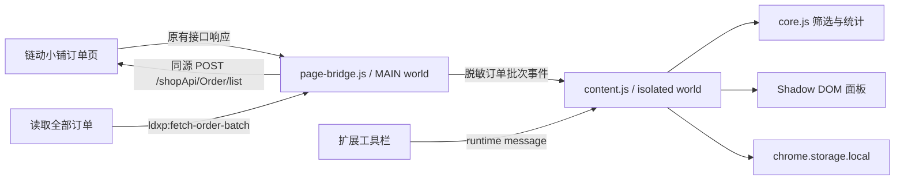

# 架构与二次开发说明

## 设计目标

扩展只增强用户已经打开的链动小铺订单列表页。它不接管登录或验证码流程，不读取订单权益内容，也不把订单传给第三方。

主要约束：

- Manifest V3，无构建步骤和运行时依赖
- 界面使用 Shadow DOM，避免污染站点 CSS
- 页面查询凭证不进入扩展本地存储
- 金额以整数分保存和计算
- 站点接口变化时，可集中修改桥接和解析模块

## 数据流



## 执行上下文

### `src/page-bridge.js`

在 `document_start` 运行于 `MAIN` world。主要职责：

1. 观察页面原有 `fetch` 和 `XMLHttpRequest` 的订单列表响应，提取订单号与 `goods_key` 的映射。
2. 响应隔离世界发出的批量读取事件。
3. 从当前 URL 读取 `keywords` 和 `ticket`，直接调用同源订单列表接口。
4. 只把白名单订单字段发送给隔离世界，不发送 `keywords`、`ticket` 或完整响应。

主世界代码可能受到页面脚本影响，因此隔离世界不能无条件信任它返回的数据。

### `src/content.js`

运行于扩展隔离世界。主要职责：

- 创建和更新 Shadow DOM 界面
- 验证商品 URL 必须属于当前站点且路径以 `/item/` 开头
- 合并、去重和持久化订单
- 后台批次调度、进度与错误状态
- 悬浮球、面板拖动和面板缩放
- CSV 导出

### `src/core.js`

UMD 风格的纯逻辑模块，可同时在内容脚本和 Node.js 测试中使用。

主要 API：

- `extractOrders(document)`：从当前表格解析订单
- `applyFilters(orders, filters, now)`：应用筛选
- `sortOrders(orders, sort)`：排序
- `summarize(orders)`：总金额、订单数、均价和活跃天数
- `groupByDay(orders)`：每日汇总
- `mergeOrders(existing, incoming)`：按订单号去重合并

### `src/background.js`

只监听扩展工具栏点击，并向当前订单页发送 `LDXP_OPEN_ASSISTANT`。网络读取不经过 Service Worker，避免扩展源请求与站点人机校验上下文不一致。

## 页面事件协议

事件载荷统一使用 JSON 字符串，降低不同 JavaScript world 之间传递对象的兼容性问题。

### 商品链接

| 事件 | 方向 | 载荷 |
| --- | --- | --- |
| `ldxp:request-product-links` | isolated → MAIN | 无 |
| `ldxp:product-links` | MAIN → isolated | `{ "订单号": "https://pay.ldxp.cn/item/..." }` |

### 订单批次

`ldxp:fetch-order-batch`，isolated → MAIN：

```json
{
  "requestId": "随机请求 ID",
  "current": 1,
  "pageSize": 100
}
```

`ldxp:order-batch-result`，MAIN → isolated：

```json
{
  "requestId": "随机请求 ID",
  "total": 214,
  "orders": [
    {
      "orderNo": "LD...",
      "productName": "示例商品",
      "createTimestamp": 1786310000,
      "totalAmount": "12.50",
      "quantity": 1,
      "status": 1,
      "productUrl": "https://pay.ldxp.cn/item/example"
    }
  ]
}
```

失败时返回 `{ "requestId": "...", "error": "错误信息" }`。

## 订单接口约定

当前站点接口：

```text
POST https://pay.ldxp.cn/shopApi/Order/list
Content-Type: application/json
```

当前“全部”状态请求体：

```json
{
  "status": 999,
  "current": 1,
  "pageSize": 100,
  "total": 0,
  "keywords": "来自当前 URL，不持久化",
  "ticket": "来自当前 URL，不持久化"
}
```

批量算法先请求 100 条，根据返回的 `total` 和实际批次长度计算剩余批次，再以最多 4 个并发请求补齐。全过程不点击页面分页控件。

## 订单数据模型

扩展内部订单结构：

```js
{
  orderNo: "LD...",
  productName: "商品名",
  createTime: "2026-08-10 04:39:37",
  date: "2026-08-10",
  amountCents: 125,
  quantity: 1,
  status: "已付款",
  productUrl: "https://pay.ldxp.cn/item/..."
}
```

状态映射当前为：

| 接口值 | 显示值 | 计入有效消费 |
| --- | --- | --- |
| `0` | 待付款 | 否 |
| `1` | 已付款 | 是 |
| `2` | 已退款 | 否 |
| `3` | 已关闭 | 否 |

未知状态会显示为 `状态 N`。`core.isEffectiveStatus` 还会按文字排除取消、关闭、退款和未付款状态。

## DOM 解析兜底

当前页同步由 `core.extractOrders` 完成。它寻找同时包含“商品名”“订单号”“金额”的表格，并使用以下站点类名：

- `.goods-name`
- `.create-time`
- `.total_amount`
- `.quantity`
- `.arco-tag`

站点替换 UI 组件库后，应优先更新这里，并为解析逻辑增加脱敏夹具测试。

## 本地存储

- 设置键：`ldxp-consumption-assistant-settings-v1`
- 订单键：`ldxp-consumption-orders-v1-{keywords SHA-256 前 20 位}`

订单按查询标识的哈希隔离。原始 `keywords` 和 `ticket` 不写入存储。订单缓存会跨刷新保留，便于查看历史统计。

## 扩展新站点

若要二次开发支持其他站点，建议：

1. 为站点创建独立 bridge 和 adapter，不要在现有函数中堆叠大量域名判断。
2. 将统一订单数据映射到上述内部模型。
3. 为每个域名单独配置最小 `host_permissions` 和 `matches`。
4. 保持查询凭证只在对应站点主世界使用。
5. 为新适配器添加独立模拟页和测试数据。
